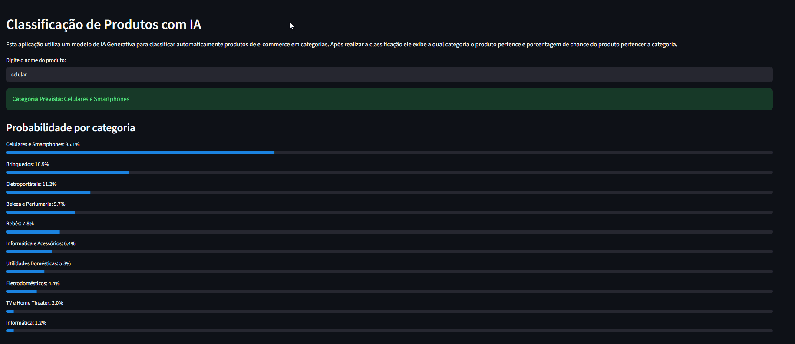
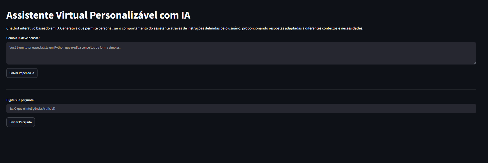
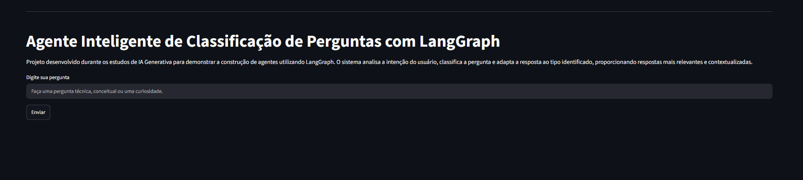

# Projeto IA Generativa | SENAI

> Projeto desenvolvido durante o curso **Inteligências Artificiais Generativas Aplicada à Programação - ChatGPT**, realizado pelo **SENAI-SP**.

Este repositório reúne os desafios desenvolvidos durante o curso, aplicando conceitos de Inteligência Artificial Generativa, Machine Learning, Processamento de Linguagem Natural (NLP) e construção de agentes inteligentes utilizando Python.

---

# Objetivos

Aplicar na prática os conhecimentos adquiridos durante o curso através do desenvolvimento de aplicações utilizando IA Generativa.

O projeto contempla desde modelos tradicionais de Machine Learning até aplicações modernas utilizando LLMs, LangChain e LangGraph.

---

# Funcionalidades

## ✅ Desafio 1 — Classificação Inteligente de Produtos

Sistema que classifica automaticamente produtos de e-commerce em categorias utilizando um modelo de Machine Learning previamente treinado.

**Recursos**

- Pré-processamento utilizando spaCy
- Pipeline de Machine Learning
- Probabilidade de cada categoria
- Interface construída com Streamlit

---

## ✅ Desafio 2 — Chatbot Personalizável

Assistente virtual baseado em IA Generativa onde o usuário pode definir o comportamento da IA antes de iniciar a conversa.

**Recursos**

- Memória de conversa
- Papel personalizado da IA
- LangChain
- Integração com Groq API
- Interface em Streamlit

---

## ✅ Desafio 3 — Agente Inteligente com LangGraph

Agente desenvolvido utilizando LangGraph capaz de identificar o tipo de pergunta realizada pelo usuário antes de gerar uma resposta.

Fluxo do agente:

Pergunta

↓

Classificação da intenção

↓

Definição do estilo da resposta

↓

Resposta personalizada

Categorias identificadas:

- Técnica
- Conceitual
- Curiosidade

---

# 🛠 Tecnologias Utilizadas

- Python
- Streamlit
- Scikit-Learn
- spaCy
- LangChain
- LangGraph
- Groq API
- ChatGPT
- NLP
- Machine Learning

---

# Demonstração

### Desafio 1



### Desafio 2


### Desafio 3


# Como executar

Clone o projeto

```bash
git clone https://github.com/seuusuario/projeto-ia-generativa.git
```

Entre na pasta

```bash
cd projeto-ia-generativa
```

Instale as dependências

```bash
pip install -r requirements.txt
```

Configure sua chave da API da Groq

```
GROQ_API_KEY=sua_chave
```

Execute

```bash
streamlit run app.py
```

---

# Aprendizados

Durante este projeto foram aplicados conhecimentos em:

- Inteligência Artificial Generativa
- Engenharia de Prompt
- Machine Learning
- Processamento de Linguagem Natural (NLP)
- LangChain
- LangGraph
- Desenvolvimento de aplicações com Streamlit
- Consumo de APIs de LLMs
- Organização de aplicações em Python

---

# 🎓 Curso

**Inteligências Artificiais Generativas Aplicada à Programação - ChatGPT**

Escola SENAI de Valinhos

Carga horária: **48 horas**

Conclusão: **Junho/2026**

---

# Próximos passos

- Refatorar a arquitetura do projeto
- Melhorar a interface gráfica
- Implementar banco de dados
- Exportação de relatórios
- Deploy em nuvem
- Docker
- Testes automatizados

---

# Autor

**Leonardo de Freitas Mafra**

Técnico Eletromecânico em transição para a área de Ciência de Dados e Inteligência Artificial.

LinkedIn: [Leonardo Mafra](https://linkedin.com/in/leonardo-freitas-mafra)

GitHub: [Leonardo Mafra](https://github.com/LeonardoMafra)
